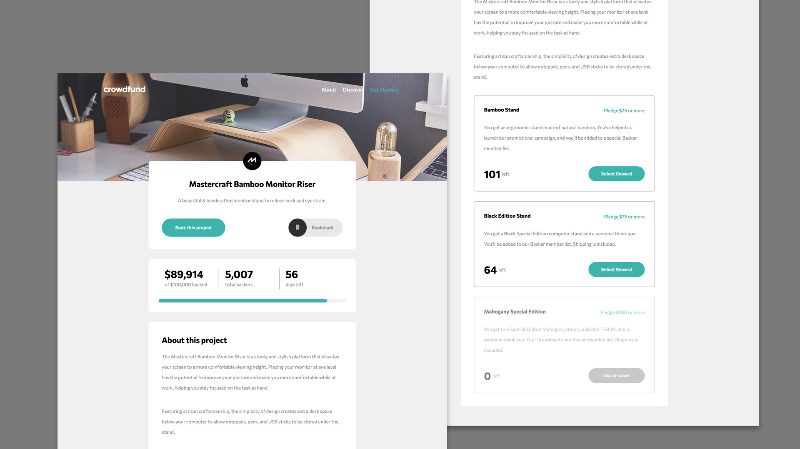

# Frontend Mentor - Crowdfunding product page solution

This is a solution to the [Crowdfunding product page challenge on Frontend Mentor](https://www.frontendmentor.io/challenges/crowdfunding-product-page-7uvcZe7ZR). Frontend Mentor challenges help you improve your coding skills by building realistic projects.

## Table of contents

- [Overview](#overview)
  - [The challenge](#the-challenge)
  - [Screenshot](#screenshot)
  - [Links](#links)
- [My process](#my-process)
  - [Built with](#built-with)
  - [What I learned](#what-i-learned)
  - [Continued development](#continued-development)
  - [Useful resources](#useful-resources)
- [Author](#author)
- [Acknowledgments](#acknowledgments)

## Overview

### The challenge

Users should be able to:

- View the optimal layout depending on their device's screen size
- See hover states for interactive elements
- Make a selection of which pledge to make
- See an updated progress bar and total money raised based on their pledge total after confirming a pledge
- See the number of total backers increment by one after confirming a pledge
- Toggle whether or not the product is bookmarked

### Screenshot




### Links

- Solution URL: [My solution](https://www.frontendmentor.io/solutions/crowdfunding-product-page-css-html5-javascript-mobile-1st-D9yWxhP2Be)
- Live Site URL: [My live site](https://andrewgharrington.github.io/crowdfunding-product-page-main/)

## My process

### Built with

- Semantic HTML5 markup
- CSS
- Flexbox
- Javascript
- Mobile-first workflow

### What I learned

This challenge really helped me implement a lot of new techniques. Some new things would be:

- really considering which tags to use for semantic HTML
- using a lot of CSS styles I haven't used before, like transitions, a lot of flexbox stuff, working with svgs
- extensive use of Javascript to manipulate a website

Below are some code snippets that show off some new things I learned or I was just happy they way I was able to write some reusable code in functions:

```css
#svg-clicked {
  filter: invert(18%) sepia(9%) saturate(4348%) hue-rotate(129deg) brightness(
      99%
    ) contrast(84%);
}
```

```css
.selection-modal,
.nav-list-container,
.modal-pledge-complete-container {
  position: absolute;
  margin: 0;
  top: 0;
  left: 0;
  width: 100vw;
  padding: 25px;
  z-index: 1;
  opacity: 0;
  transition: opacity 0.3s ease;
  pointer-events: none;
}
```

```js
// makes the modal visible if it is not visible, and vice-versa
// if the pledge complete modal is visible, it hides the pledge selection modal
function toggleModal(modal) {
  if (modal.style.opacity === "0" || modal.style.opacity === "") {
    console.log("in toggleModal: modal was off and is now turned on");
    modal.style.opacity = "1";
    modal.style.pointerEvents = "auto";
  } else if (modal.style.opacity === "1") {
    console.log("in toggleModal: modal was on and is now turned off");
    modal.style.opacity = "0";
    modal.style.pointerEvents = "none";
  }

  if (modal === modalPledgeCompleteContainer) {
    selectionModal.style.opacity = "0";
    selectionModal.style.pointerEvents = "none";
  }
}
```

```js
// checks if the pledge amount you enter is within the range for that plede.
// if not, it will make the pledge amount the min and not continue on
function pledgeInRangeCheck(input, min, max) {
  if (Number(input.value) < min || Number(input.value) > max) {
    input.value = min;
    return false;
  } else {
    return true;
  }
}
```

```js
function convertNumberToStringWithCommas(number) {
  return number.toString().replace(/\B(?=(\d{3})+(?!\d))/g, ",");
}
```

### Continued development

I know that there are a lot of ways I could write better code for this project, and I think this project will help me plan better and have better ideas for projects moving forward, but I feel a great sense of accomplishment by being able to make this site. I don't think I would have had as much success building this if I hadn't watched Zach Gollwitzer's Front End youtube series.

I know that I should go back and refactor some of my CSS and JS to make it cleaner, but I've spent probably close to 40 hours on this. I would like to move on to the next one and use what I've learned from this project to write cleaner code moving forward.

### Useful resources

- [Zach Gollwitzer's Frontend Development Series](https://www.youtube.com/watch?v=zJSY8tbf_ys) - I never would have been able to complete this project
- [freeCodeCamp.org](https://www.youtube.com/c/Freecodecamp) - another resource with tons of web development videos (and all kinds of other programming)

## Author

- Website - [Andrew Harrington](https://github.com/AndrewGHarrington)
- Frontend Mentor - [@AndrewGHarrington](https://www.frontendmentor.io/profile/AndrewGHarrington)

## Acknowledgments

This is where you can give a hat tip to anyone who helped you out on this project. Perhaps you worked in a team or got some inspiration from someone else's solution. This is the perfect place to give them some credit.

- Zech Gollwitzer - [Zach's Youtube Channel](https://www.youtube.com/c/ZachGollwitzer)
